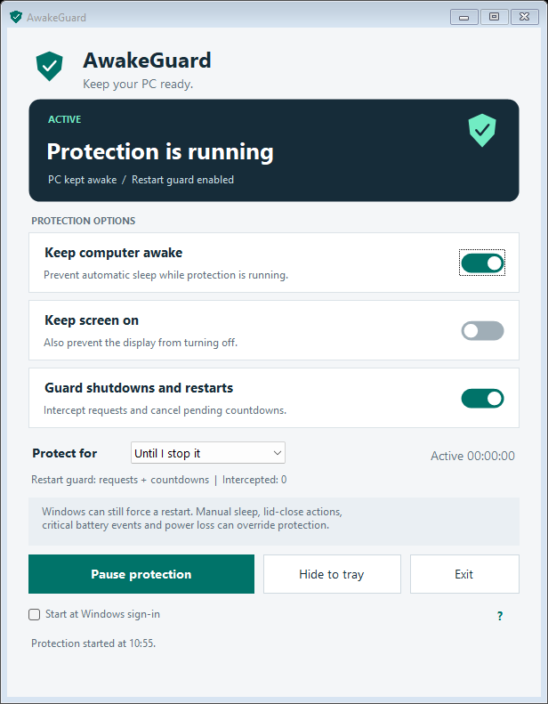

# AwakeGuard

A portable Windows application that prevents idle sleep and provides best-effort shutdown and restart protection.



## Run

Download this repository as a ZIP, extract it, and double-click **AwakeGuard.exe**. Keep `AwakeGuard.exe.config` beside the executable. Windows 10 or 11 with .NET Framework 4.8 or newer is required; no installer or additional packages are needed.

Protection starts automatically. Closing or minimizing the window keeps the app in the system tray. Double-click the tray shield to reopen it. Choose **Pause protection** to release the requests, or **Exit** to stop the app.

## Features

- Prevent automatic idle sleep, with optional display protection.
- Intercept ordinary shutdown and restart requests and attempt to cancel pending countdowns.
- Run indefinitely or for 30 minutes, 1, 2, 4, or 8 hours.
- Pause and resume from the window or tray menu.
- Optionally start in the tray at Windows sign-in.
- Show whether countdown cancellation is available and report Windows API errors.

## Windows limitations

Shutdown and restart protection is **best effort**. Windows can override an app, including for forced updates, critical shutdowns, immediate restarts, or when the user selects **Restart anyway**. If Windows displays a blocking-app screen, choose **Cancel** to remain running.

Idle-sleep protection does not override manual sleep, lid and power-button actions, critical battery events, hardware faults, or power loss. Sign-out and application servicing are allowed. Windows Update services and power-plan settings are not changed.

An interception count records requests handled and countdowns cancelled; it does not guarantee a restart was prevented. The application must remain running for protection. See [README.txt](README.txt) for complete usage, preferences, and removal instructions.

## Build and test

The source and tests are included under `source/`. The scripts use the C# compiler bundled with .NET Framework; they do not download dependencies.

```powershell
powershell.exe -NoProfile -ExecutionPolicy Bypass -File .\Build.ps1
powershell.exe -NoProfile -ExecutionPolicy Bypass -File .\Test.ps1
```

The execution-policy option applies only to that PowerShell process. The executable is locally built and unsigned.

38 validation checks passed, covering timer expiry, failure handling, power-request flags, shutdown-reason registration and removal, privilege restoration, the window's shutdown handler, hidden-window registration, and cleanup. No real shutdown or restart was initiated during validation.

## Microsoft references

- [SetThreadExecutionState](https://learn.microsoft.com/en-us/windows/win32/api/winbase/nf-winbase-setthreadexecutionstate)
- [ShutdownBlockReasonCreate](https://learn.microsoft.com/en-us/windows/win32/api/winuser/nf-winuser-shutdownblockreasoncreate)
- [WM_QUERYENDSESSION](https://learn.microsoft.com/en-us/windows/win32/shutdown/wm-queryendsession)
- [AbortSystemShutdown](https://learn.microsoft.com/en-us/windows/win32/api/winreg/nf-winreg-abortsystemshutdownw)
